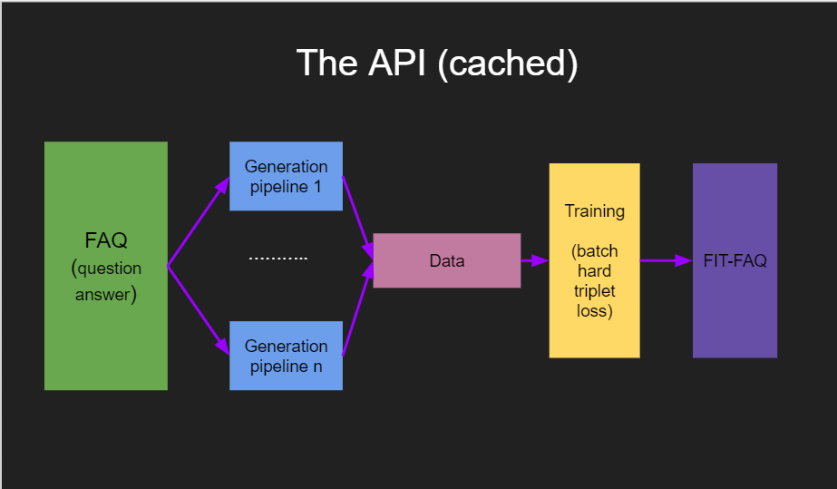

# FAQ-QnA-matching

This project aims to build an end to end soution for Knowledge based question answering. The end result should be  
able to take any generic FAQ as input and produce an FAQ chat bot that answers any questions within that particulat domain.

## Method
   
 
 ### FAQ
 The faq in this context is a list of questions and answers....  
 ```
 Q) How to get to the DLF office from Rajeev Chowk ?  
 A) Once you are on Rajeev Chowk , you can reach the Copper Heights compex and take a right towards sadhna road , the DLF office will be on the left side, after 100 meters.
 ```
 
 ### Generation Pipelines
 The generation pipelines aim to augment the question so as to produce semantically similar questions , but rephrased.
 ```
 Q) How to get to the DLF office from Rajeev Chowk ?
 G1) I am on Rajeev Chowk , now how do i reach the DLF office ?
 G2) How can one reach the DLF office from Rajeev Chowk ?
 G3) Please provide directions for reaching the DLF office from Rajeev Chowk.
 ......
 ```
 
 This generation process is carried out in different pipelines(methods) , some of the methods are Synonyms replacement , Fuzzy template matching, Back translation etc.  
 You can easily add your own augmentation technique and control the number of questions you want to generate with this pipeline.  
 INSERT TUTORIAL HERE  
 Note that all generation process are run independently as a seperate process , but the entire module will wait for all the generation pipeline to finish.
 So make sure that your generation pipeline can finish in reasonable time....
 
 
 
 ### Data
 Data is just all the generated questions , along with the orignal questions, and the answers. This data is stored on disc so that we dont have to repeat the entire
 process again. The data is stored as two seperate dictionaries.  
 ```
 QuestionTolabel -
  How to get to the DLF office from Rajeev Chowk ? --> 1 (label)
  How can one reach the DLF office from Rajeev Chowk ? --> 1 (label)
  How is the weather today ? --> 2 (different label as its not the same question)
  
 AnswerTolabel -
  Once you are on Rajeev Chowk , you can reach the Copper Heights compex and take right ...  --> 1 (label)
  The weather is rainy today --> 2 (label)  
 ```
The dictionaries are stored in pickle format in FAQs folder.


### Training
This project uses [The sentence transformers library](https://pypi.org/project/sentence-transformers/), to convert sentences into vectors , I have started with a pretrained roberta model. The model is then fine tuned on the specific FAQ using [batch hard triplet loss](https://arxiv.org/pdf/1703.07737.pdf).  
**This is why there should be atleast 2 questions for a label in the dataset**

### Fit-FAQ
This step passes all the questions through the model and obtains vectors , these vectors are stored in the FAQs folder as well , and will be used in further calls instead of 
making the vectors all over again.

### Answering questions !!!
When a user asks a question , his/her question is also converted to a vector by the model , now the model searches for the closest question(from the questions we had previously generated + orignal FAQs questions) and returns the answer corrosponding to the closest question. The closest question is determined using **cosine similirity**.  
Instead of using a simple closest I have employed a KNN, kind of search.


## How to Run the code ?

